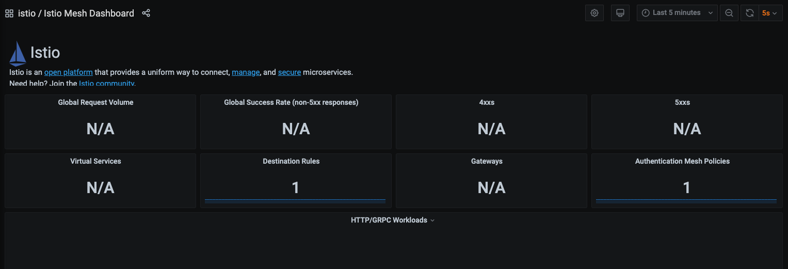
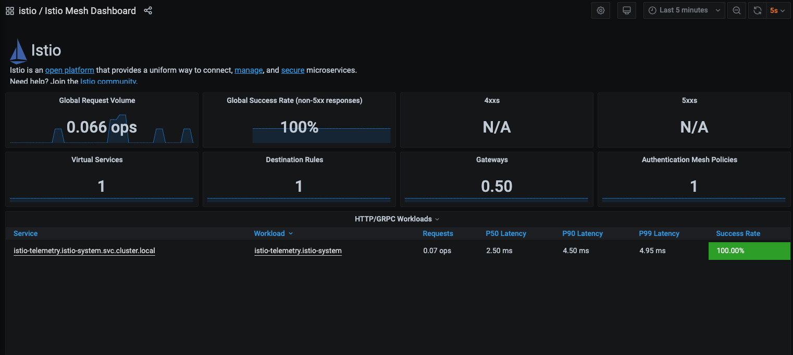
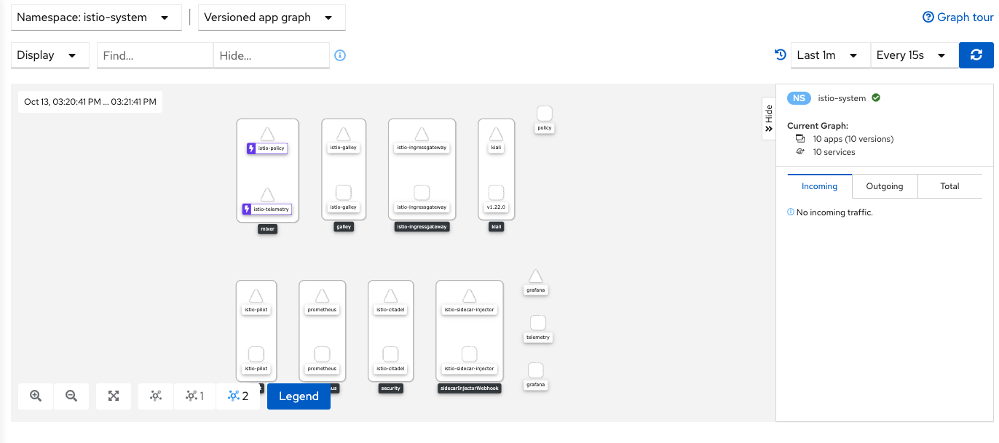
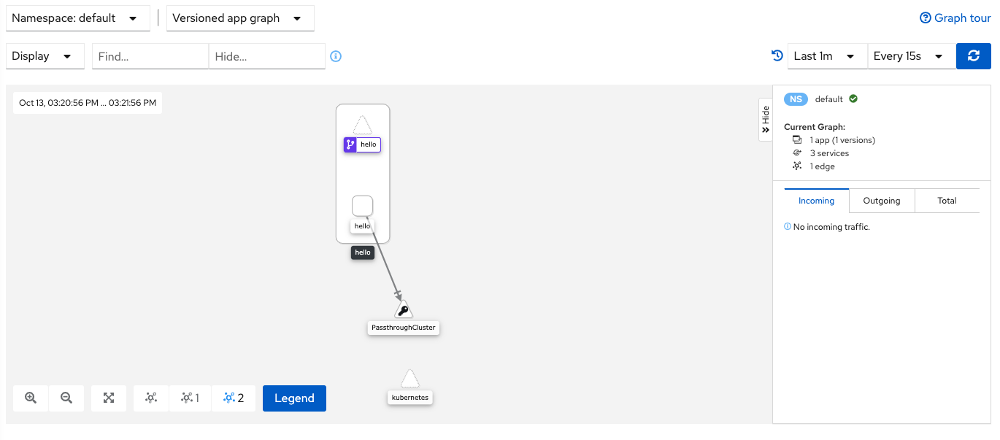

# istio-lab
A lab for setting up Istio with minikube


## Install Istio on [Minikube](https://minikube.sigs.k8s.io/docs/start/)
```
minikube start --memory=16384 --cpus=4
minikube addons enable helm-tiller

kubectl create namespace istio-system
```

### Get the latest Istio binary [here](https://github.com/istio/istio/releases/)

```
wget https://github.com/istio/istio/releases/download/1.5.0/istio-1.5.0-osx.tar.gz
tar -xf istio-1.5.0-osx.tar.gz && rm -f istio-1.5.0-osx.tar.gz
```

### Install Istio via helm
```
# install the bootstrapper
helm install --name istio-init --namespace istio-system istio-1.5.0/install/kubernetes/helm/istio-init

# check for the CRDs
kubectl -n istio-system wait --for=condition=complete job --all 
    job.batch/istio-init-crd-all-1.5.0 condition met
    job.batch/istio-init-crd-mixer-1.5.0 condition met

kubectl -n istio-system get crds


# install istio
helm install --name istio --namespace istio-system istio-1.5.0/install/kubernetes/helm/istio 

# verify
kubectl -n istio-system get svc
    istio-citadel            ClusterIP      10.100.1.20      8060/TCP,15014/
    istio-galley             ClusterIP      10.104.180.240   443/TCP,15014/TCP,9901/
    istio-ingressgateway     LoadBalancer   10.105.84.141    15020:30682/TCP,80:31380/TCP,443:31390/TCP,
                                                             31400:31400/TCP,15029:31007/TCP,15030:31552/TCP,
                                                             15031:30720/TCP,15032:31523/TCP,15443:31709/TCP    
    istio-pilot              ClusterIP      10.98.95.98      15010/TCP,15011/TCP,8080/TCP,15014/
    istio-policy             ClusterIP      10.102.42.150    9091/TCP,15004/TCP,15014/
    istio-sidecar-injector   ClusterIP      10.110.110.188   443/TCP,15014/
    istio-telemetry          ClusterIP      10.108.52.155    9091/TCP,15004/TCP,15014/TCP,42422/
    prometheus               ClusterIP      10.100.203.238   9090/

kubectl -n istio-system get pods 
    istio-citadel-7b95d6cdf7-kvvgn           Running  
    istio-galley-78448d877b-jh5jc            Running  
    istio-ingressgateway-588ddcb58-99lmb     Running  
    istio-init-crd-all-1.5.0-xr9gn           Completed
    istio-init-crd-mixer-1.5.0-6zg2z         Completed
    istio-pilot-847c86787b-5x9jm             Running  
    istio-policy-859c75c4b7-67p77            Running  
    istio-sidecar-injector-7db6f668b4-scz2j  Running  
    istio-telemetry-7df546557f-8jt2j         Running  
    prometheus-c8fdbd64f-qhl56               Running 

# only for minikube
export INGRESS_PORT=$(kubectl -n istio-system get service istio-ingressgateway -o jsonpath='{.spec.ports[?(@.name=="http2")].nodePort}')
export SECURE_INGRESS_PORT=$(kubectl -n istio-system get service istio-ingressgateway -o jsonpath='{.spec.ports[?(@.name=="https")].nodePort}')
 
```

### Sidecar Injection
```
# Automatic Injection
kubectl label namespace default istio-injection=enabled

# verify
kubectl get namespace -L istio-injection
    NAME                   STATUS   AGE   ISTIO-INJECTION
    default                Active   22m   enabled

```

## Observability
```
kubectl -n istio-system get svc prometheus

kubectl -n istio-system get svc grafana
# if you don't have grafana addon, install it using :
kubectl apply -f https://raw.githubusercontent.com/istio/istio/release-1.7/samples/addons/grafana.yaml -n istio-system

# if you don't have kiali
kubectl apply -f https://raw.githubusercontent.com/istio/istio/release-1.7/samples/addons/kiali.yaml -n istio-system

```

## Testing the Mesh
If you see your dashboard : `Istio / Istio Mesh Dashboard`, you will find that it's empty. 


### Setup Networking Tunnel
```
export INGRESS_PORT=$(kubectl -n istio-system get service istio-ingressgateway -o jsonpath='{.spec.ports[?(@.name=="http2")].nodePort}')

export SECURE_INGRESS_PORT=$(kubectl -n istio-system get service istio-ingressgateway -o jsonpath='{.spec.ports[?(@.name=="https")].nodePort}')

export INGRESS_HOST=$(minikube ip)

export GATEWAY_URL=$INGRESS_HOST:$INGRESS_PORT

# verify
echo "$INGRESS_PORT"
echo "$SECURE_INGRESS_PORT"
echo "$INGRESS_HOST"
echo "$GATEWAY_URL"

# in a different terminal window
minikube tunnel

```
### Install Apps

```
# Install our demo apps
kubectl apply -f k8s/hello
kubectl apply -f k8s/istio-demo

# Install routing gateway
kubectl apply -f k8s/routing.yaml

# verify
kubectl describe pod -l app=istio-demo
kubectl describe pod -l app=hello
```

> Verify
```
curl -H "Host:hello.demo" http://$GATEWAY_URL                                                                         
<link rel="stylesheet" type="text/css" href="css/style.css" />
<div class="container">
    Hello World!
</div>%
```

## Grafana
`istioctl -n istio-system dashboard grafana`


## Kiali
`istioctl -n istio-system dashboard kiali`




# Cleanup
`minikube delete`


